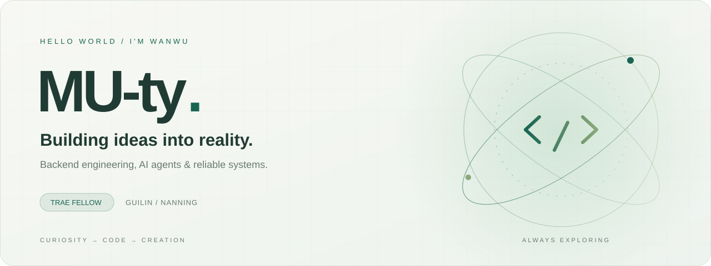

<!-- Custom artwork is stored in this repository; no external banner service required. -->

  

  <strong>把想法写成代码，把代码变成体验。</strong> 
  Hi, I'm Wanwu — a TRAE Fellow based in Guilin &amp; Nanning.

  
  
  

---

### 01 / About me

你好，我是 **穆天宇 / Wanwu**，桂林电子科技大学计算机科学与技术专业本科生。聚焦 **后端工程与 AI Agent**，关注 LLM、RAG、多模态 AIGC 在真实业务中的工程化落地。

从需求分析、技术选型到开发部署，我喜欢把一个想法做成可以运行、可以使用的系统。

- **Identity** · MU-ty / Wanwu / TRAE Fellow
- **Based in** · 桂林 & 南宁
- **Education** · 桂林电子科技大学 · 计算机科学与技术 · 2024–2028
- **Focus** · Backend engineering · AI agents · Frontend development
- **Open to** · 围绕 [LT](https://github.com/hust-open-atom-club/LT) 的交流与协作

### 02 / Selected projects

<table>
<tr>
<td width="50%" valign="top">
<h3>01 · Tiny Redis Blog</h3>

<strong>从博客业务，深入 Redis 底层。</strong>

基于 Spring Boot、MySQL 与 Redis 的全栈博客，覆盖缓存、登录、排行榜与 Feed 流；使用 C++20 实现 RESP2 教学服务，探索 TCP 拆包、TTL 与 AOF 持久化。

<strong>语言</strong> · Java · C++20 · JavaScript · HTML · CSS

<code>Spring Boot</code> <code>MySQL</code> <code>Redis</code> <code>RESP2</code>

<a href="https://github.com/MU-ty/tiny-redis-blog">查看源码 ↗</a>

</td>
<td width="50%" valign="top">
<h3>02 · Urban Resilience Hub</h3>

<strong>用可靠后端，连接社区物资需求。</strong>

以桂林为演示场景的社区物资共享系统，按 FEFO 策略并发预留库存，通过事务 Outbox 与 RabbitMQ 传递事件，结合 Redis 缓存、幂等与 JWT / RBAC 鉴权。

<strong>语言</strong> · Java · JavaScript · HTML · CSS · SQL

<code>Spring Boot</code> <code>Redis</code> <code>RabbitMQ</code> <code>MySQL</code>

<a href="https://github.com/MU-ty/urban-resilience-hub">查看源码 ↗</a>

</td>
</tr>
</table>

### 03 / Experience & impact

**3 段 AI / 科研实习 · 从模型能力到工程落地**

| 时间 | 团队 / 岗位 | 实践与收获 |
| :--- | :--- | :--- |
| **2026.07–2026.09** | **bilibili · Peanut** Agent 开发实习生 | 参与 Scene 级 AI 视频生成 Pipeline，完成分镜规划、素材检索、Prompt 构建、视频生成、Timeline 映射与 Draft 写回；使用有界并发和异常降级提升长耗时任务稳定性。 AI Video · asyncio · Multimodal |
| **2025.10–2026.01** | **武汉金银湖实验室** 科研开发实习 | 构建面向 RST 结构化文档的长文档翻译智能体，支持批量翻译、双语摘要、局部重译，并完成翻译成果的静态网页部署。 LLM Agent · RST · GitHub Pages |
| **2025.07–2025.08** | **华为北京办事处 AI 工作台** AI 应用开发 | 搭建面试知识库 RAG 与简历岗位匹配体系，融合 TF-IDF、向量检索、LDA、规则匹配和 LLM 综合评估，输出结构化分析报告。 RAG · NLP · Matching |

### 04 / Awards & recognition

| 荣誉 | 赛事 / 社区 |
| :--- | :--- |
| **TRAE Fellow · 2025 年度社区突出贡献奖** | TRAE 社区 |
| **二等奖** | 武汉 1024 智能体开发大赛 |
| **三等奖** | AdventureX 2026 · bilibili 赛道 |
| **铜奖** | Build with Qwen GenZ |

### 05 / Growth archive

<table>
<tr>
<td valign="top">
<h3>成长坐标 · 记录经历，看见成长。</h3>

把走过的路，变成继续前行的底气。持续整理实习收获、人脉图谱、LeetCode Hot 100、计算机基础、随手记与面试复盘，让每次输入都成为可以复用的经验。

<a href="https://internship-growth-journal.mut520854.chatgpt.site/"><strong>进入成长坐标 ↗</strong></a>

</td>
</tr>
</table>

### 06 / My toolkit

| Area | Technologies |
| :--- | :--- |
| **Languages** | Java · Python · C · C++ · JavaScript · HTML / CSS · SQL · Bash |
| **Frameworks** | Spring Boot · FastAPI · Django · PyQt |
| **Data** | MySQL · Redis · SQLite · PostgreSQL |
| **Tools** | Git · GitHub · GitLab · Docker · PyCharm · VS Code |
| **AI / Agent** | LangChain · LlamaIndex · RAG · MCP · Multi-Agent |
| **Exploring** | Backend reliability · Frontend · Multimodal AIGC |

### 07 / Beyond the code

在 [**MU-ty's Blog**](https://mu-ty.github.io/mty_blog) 记录思考与探索，也欢迎聊聊有意思的项目。

**Let's build something useful.** → [3417633465@qq.com](mailto:3417633465@qq.com)

---

  好奇心是起点，创造是下一步。 Curiosity starts it. Building carries it forward.

